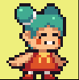
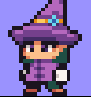
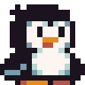
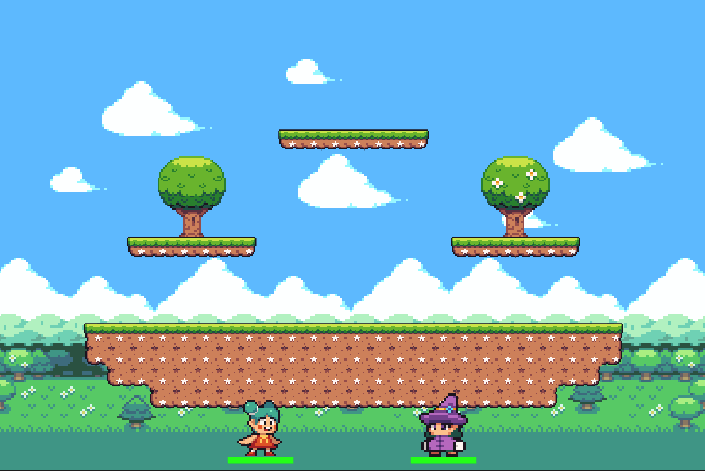
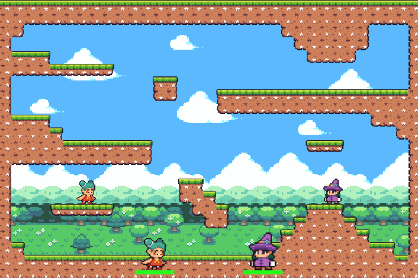
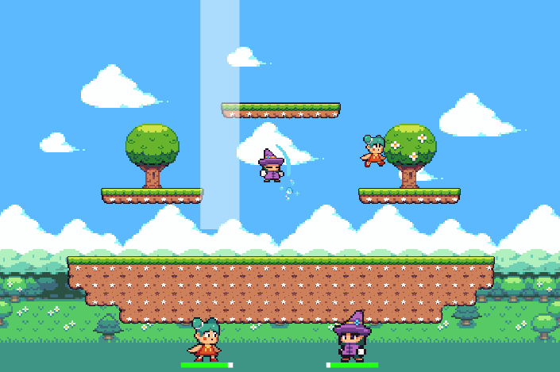
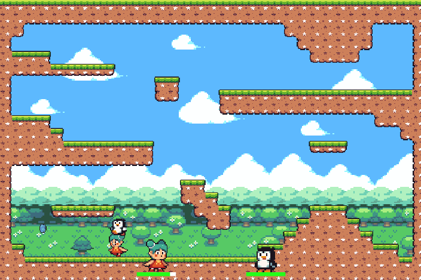
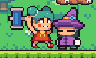
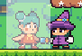
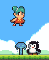

<h1>Pixel Fighters - Final Intro Exam Project</h1>

Pixel Fighters is fighting game, with singleplayer and multiplayer modes, where each player plays as a character with unique attacks. The player has a selection of three different characters and two different maps. The players use their attacks to fight each other, and the game ends once one player's health goes to zero.

<h2><a href="https://editor.p5js.org/738991/full/p36fUUunD">Link to Play</a></h2>
<h2>Controls</h2>
<h3>Player One:</h3>

Movement: WASD

Attacks: FGH

<h3>Player Two:</h3>

Movement: Arrow Keys

Attacks: <>?

<h2>Art Credits</h2>

Art is by <a href="https://grafxkid.itch.io">grafxkid on itch.io</a>

<h2>Character Screenshots</h2>

<h2>Map Screenshots</h2>

<h2>Gameplay Screenshots</h2>

